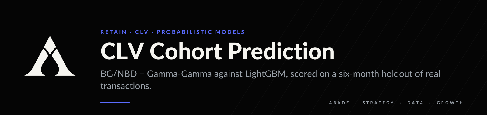
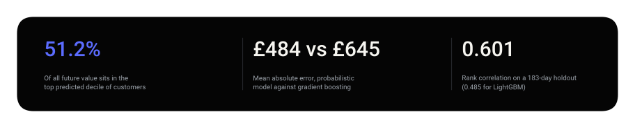
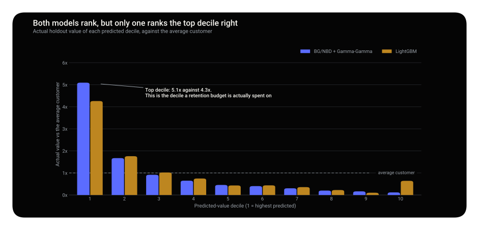
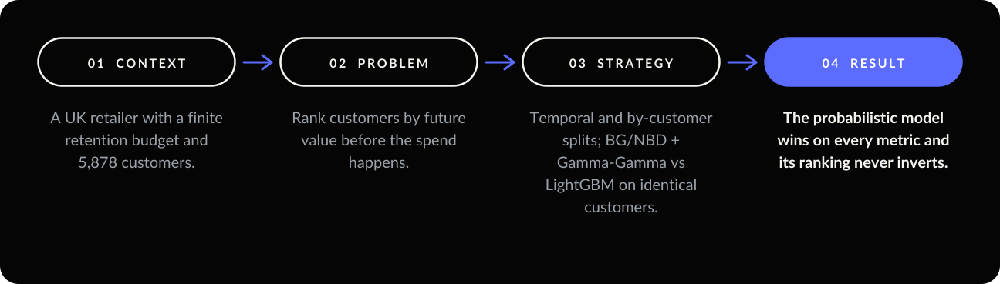
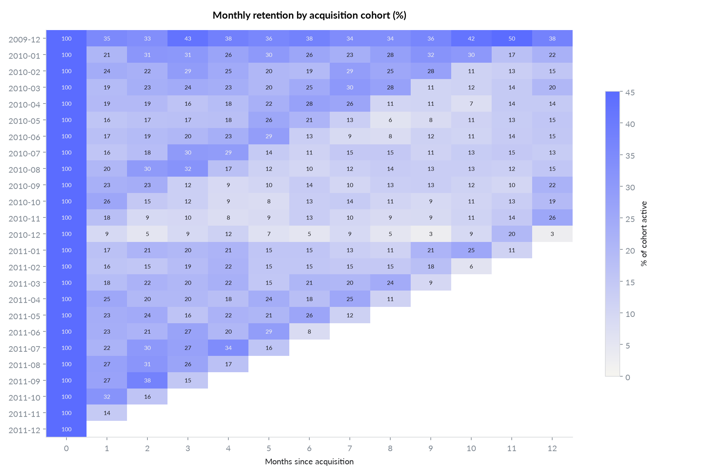
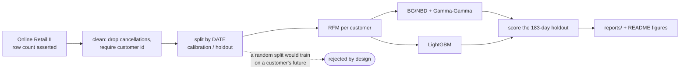
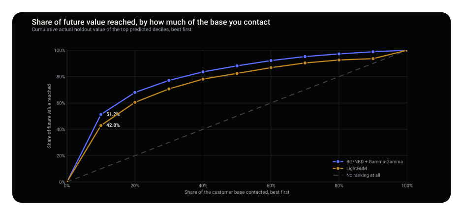
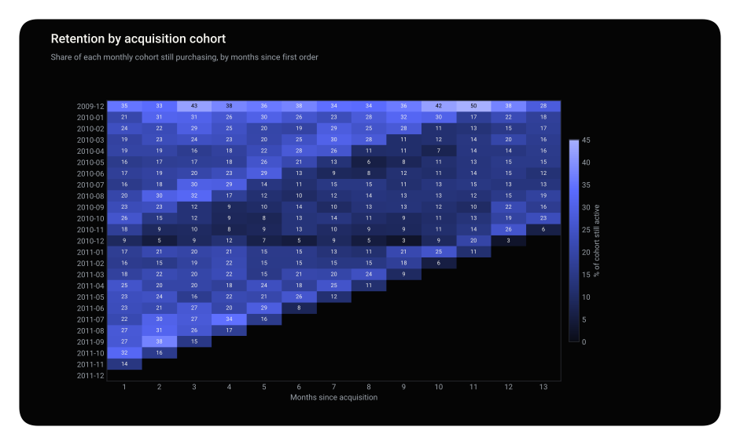

<p align="center"></p>

<p align="center">
  
  
  
  
</p>

**Contacting the top 10% ranked by the probabilistic model reaches 51.2% of all future value.** The
same budget aimed with gradient boosting reaches 42.8%, and LightGBM's lowest-ranked decile turns out
to be worth more than its middle ones.

<p align="center"></p>

<p align="center"></p>

> **Decision.** Rank the retention list with BG/NBD + Gamma-Gamma. On a programme priced per contact, the top decile is where the budget goes, and that is exactly where gradient boosting is weakest.

<details>
<summary><b>What is in this repository</b></summary>

| | |
| --- | --- |
| **The question** | Who deserves retention budget, predicted before the money is spent? |
| **The data** | Online Retail II, 4,969 customers, split by date rather than at random — a random split would train on a customer's future and score it on their past. |
| **The method** | BG/NBD + Gamma-Gamma against LightGBM, scored on a six-month holdout neither model saw. |
| **The finding** | The probabilistic model wins on every metric, and wins most where it matters commercially. |

```
src/clv/    cohorts, RFM, the two models, evaluation, figures
reports/    cohort retention matrix, decile tables, holdout metrics
tests/      the RFM construction, the split, and the evaluation maths
```

</details>

<p align="center"></p>

---

## 01 — Context

A UK online giftware retailer, mostly wholesale buyers, has a finite retention budget. Buying is
regular and repeat-heavy (67.3% repeat rate), and monthly retention settles at 15–20% after the
first-month drop instead of decaying to zero. That stable tail is what makes a CLV model worth fitting.

<p align="center"></p>

### Data

| | |
| --- | --- |
| Source | Online Retail II, UCI Machine Learning Repository ([link](https://archive.ics.uci.edu/dataset/502/online+retail+ii)) |
| Size | 1,067,371 line items · 5,878 customers after cleaning · £17.7M revenue |
| Period | 2009-12-01 to 2011-12-09 |
| Calibration | up to 2011-06-09 · **Holdout** 2011-06-10 to 2011-12-09 (183 days) |

**All data is real.** The only declared assumption is a 30% gross margin, isolated in `config.py`; it
affects no model.

| Cleaning decision | Why |
| --- | --- |
| Drop `C`-prefixed invoices | They are returns, and would turn a one-time buyer into a two-purchase customer. |
| Drop rows with no customer ID | 243,007 rows. Real revenue, but CLV is a per-person quantity. |
| **Collapse same-day invoices** | 9.1% of customer-days carry several invoices. Counting invoices inflates frequency by **11.7%** and breaks BG/NBD's one-transaction-per-period assumption. |

---

## 02 — Problem

The useful question is not *what is the average customer worth*. It is *can we rank customers well
enough that spending on the top decile beats spending at random*, predicted from behaviour before the
spend happens.

---

## 03 — Strategy

| Decision | Why |
| --- | --- |
| **A probabilistic model as the main candidate** | BG/NBD encodes how repeat buying works (a purchase process and a dropout process), so it generalises from little data. LightGBM assumes nothing, which leaves it exposed with 3,478 training customers and a long-tailed target. |
| **Temporal split** | A random split over transactions lets later purchases train a model scored on earlier ones. |
| **Customer split too** | BG/NBD needs no labels and could see everyone. Both models are fitted on the same 3,478 customers and scored on the same 1,491. |
| **MCMC, not MAP** | Credible intervals per customer matter when the output drives spend on individuals. |
| **Decile table as the headline** | A retention programme spends on a ranked list, not on the average customer. |

### Metrics

```
expected_value(customer, horizon) = E[purchases in horizon] x E[spend per purchase]
                                    \_____ BG/NBD _____/     \__ Gamma-Gamma __/
lift(decile) = mean actual holdout value in decile / mean across all customers

frequency  REPEAT purchases (a one-time buyer has frequency 0)
recency    age at last purchase, NOT days since last purchase   ← pinned by a test
T          days from first purchase to the end of calibration
```



---

## 04 — Result


**The probabilistic model beats gradient boosting on every measure**, on customers neither model saw:

| | BG/NBD + Gamma-Gamma | LightGBM |
| --- | --- | --- |
| MAE | **£484** | £645 |
| RMSE | **£1,127** | £1,790 |
| Bias | **−£18** | +£140 |
| Spearman | **0.601** | 0.485 |
| Top-decile share of holdout value | **51.2%** | 42.8% |

LightGBM predicts an average of £24 for its bottom decile, and those customers turn out to be worth
£414. It learned that thin histories spend little, which is true on average and badly wrong in the
tail. The tail is where the money is.

> **Decision.** Rank the retention list with BG/NBD + Gamma-Gamma. On a programme priced per contact,
> the gap between 51.2% and 42.8% of value reached is the entire business case.

---

<p align="center"></p>

<p align="center"></p>

---

## 05 — Limits and next move

- **One dataset, one holdout window.** With 100x the customers, the flexible model would likely close
  the gap.
- **Not every business repeats.** On a single-purchase base, as in
  [unit-economics-olist](https://github.com/arielabade/unit-economics-olist) where 97% buy once, CLV
  modelling is the wrong tool.
- **No covariates.** Country, category and channel are available, and BG/NBD cannot use them. A fair
  next comparison gives LightGBM features BG/NBD structurally cannot use.
- **Margin assumed flat at 30%.**
- **Next move:** use the posterior, not just the point estimate. The decision to contact a customer
  should weigh the probability that they are already gone.

---

## Run it

```bash
git clone https://github.com/arielabade/clv-cohort-prediction
cd clv-cohort-prediction
python -m venv .venv && source .venv/bin/activate
pip install -e ".[dev]"

python -m clv.pipeline     # downloads 45MB, parses once (~90s), then samples
python -m clv.figures      # writes reports/*.png
pytest                     # 20 tests
```

The parsed workbook is cached as Parquet, so only the first run pays the Excel cost.

## Repository map

```
src/clv/    data loading, RFM, cohorts, models, evaluation, figures
tests/      RFM conventions, cleaning rules, decile binning, split integrity
reports/    metrics.json, decile tables, cohort matrix, figures
notebooks/  retention exploration
```

---

<p align="center"></p>

<p align="center">
  <a href="https://github.com/arielabade">Portfolio</a> &nbsp;·&nbsp;
  <a href="https://github.com/arielabade/churn-cost-sensitive">Next: decide who gets the retention offer →</a>
</p>
