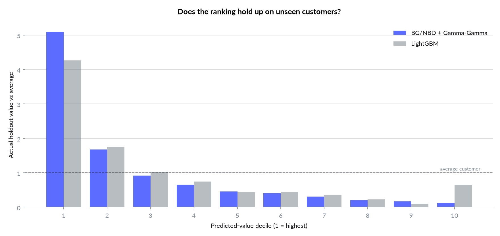

# Cohort Retention and CLV Prediction

BG/NBD + Gamma-Gamma against LightGBM, scored on a six-month holdout period.

---

## 1. Business problem

A retention budget is finite, so it has to be pointed at the customers who will actually be worth
something. That requires predicting, from behaviour observed so far, how much each customer will
spend in the next six months — before that spend happens.

The practical question is not "what is the average customer worth" but "can we rank customers well
enough that spending on the top decile beats spending at random".

---

## 2. Key results

**The probabilistic model beat gradient boosting on every measure**, on customers neither model had
seen:

| | BG/NBD + Gamma-Gamma | LightGBM |
| --- | --- | --- |
| MAE | **£484** | £645 |
| RMSE | **£1,127** | £1,790 |
| Bias | **−£18** | +£140 |
| Spearman | **0.601** | 0.485 |



**The ranking is what matters, and only one model's ranking is monotonic.** Sorting customers by
predicted value and checking what each decile was actually worth:

| Decile | BG/NBD lift | LightGBM lift |
| --- | --- | --- |
| 1 (highest) | **5.09x** | 4.26x |
| 2 | 1.67x | 1.76x |
| 3 | 0.92x | 1.02x |
| … | … | … |
| 9 | 0.16x | 0.10x |
| 10 (lowest) | **0.12x** | **0.64x** |

LightGBM's bottom decile is worth **more** than its deciles 5 through 9. It predicts an average of
£24 for customers who turn out to be worth £414. The model learned that customers with thin
calibration histories spend little, which is true on average and badly wrong in the tail — and the
tail is where the money is. BG/NBD degrades cleanly from 5.09x to 0.12x with no inversion.

**The decision this supports.** Targeting the top decile with the probabilistic model reaches
**51.2% of all holdout value** by contacting 10% of customers, against 42.8% with LightGBM. On a
retention programme priced per contact, that difference is the entire business case.

**Retention stabilises around 15–20% monthly.** After the first-month drop, cohorts settle rather
than decay to zero, which is what makes a CLV model worth fitting at all.


---

## 3. Data

| | |
| --- | --- |
| Source | Online Retail II — UCI Machine Learning Repository ([link](https://archive.ics.uci.edu/dataset/502/online+retail+ii)) |
| Content | UK online giftware retailer, largely wholesale buyers |
| Size | 1,067,371 line items · 5,878 customers after cleaning · £17.7M revenue |
| Period | 2009-12-01 to 2011-12-09 |
| Calibration | up to 2011-06-09 · **Holdout** 2011-06-10 to 2011-12-09 (183 days) |

**All data is real. Nothing in this project is simulated.** The only declared assumption is a 30%
gross margin, used to convert predicted revenue into contribution; it is isolated in `config.py` and
affects no model.

### Cleaning decisions that change the answer

| Decision | Why |
| --- | --- |
| Drop `C`-prefixed invoices | They are returns. A customer who bought once and returned it would otherwise read as a two-purchase customer. |
| Drop rows with no customer ID | 243,007 rows. Real revenue, but CLV is a per-person quantity. |
| **Collapse same-day invoices into one purchase occasion** | 9.1% of customer-days carry more than one invoice. Counting invoices inflates frequency by **11.7%** and breaks BG/NBD's assumption of at most one transaction per time unit. |

The loader asserts the raw row count against the published figure, so a changed download fails the
run instead of silently shifting every result.

---

## 4. Approach

**Why a probabilistic model at all.** BG/NBD assumes a purchase process and a dropout process and
infers their parameters. It encodes how repeat buying actually works, so it generalises from little
data. LightGBM assumes nothing and learns whatever the features support — more flexible, and more
exposed when there are 3,478 training customers and a long-tailed target.

**Why the comparison is fair.** Two splits, both necessary:

1. **Temporal**, calibration vs holdout. A random split over transactions would let a customer's
   later purchases train a model scored on their earlier ones, leaking the future into the past.
2. **By customer**, train vs test. BG/NBD needs no labels, so it could have been fitted on everyone
   — but then it would be scored on customers it had seen while LightGBM was not. Both are fitted on
   the same 3,478 customers and scored on the same 1,491.

**Why MCMC rather than MAP.** Full posterior sampling is slower but gives credible intervals on each
customer's expected value, which matters when the output drives spend on individuals.

**Why the decile table.** A retention programme does not spend on the average customer, it spends on
a ranked list. A model can have mediocre MAE and still sort well enough to be worth deploying — and,
as LightGBM shows here, the reverse is also possible.

### RFM conventions, which are easy to get backwards

```
frequency  number of REPEAT purchases, so a one-time buyer has frequency 0
recency    age at last purchase (days between first and last purchase),
           NOT "days since last purchase"
T          days between first purchase and the end of the calibration window
```

Getting `recency` backwards silently inverts the model's notion of who is still alive. It is pinned
by a test.

---

## 5. Business metrics

```
expected_value(customer, horizon) = E[purchases in horizon] x E[spend per purchase]
                                    \_____ BG/NBD _____/     \__ Gamma-Gamma __/

expected_margin = expected_value * gross_margin        (declared: 30%)

lift(decile)    = mean actual holdout value in decile / mean across all customers
```

Gamma-Gamma is fitted on repeat buyers only, and `monetary_value` excludes each customer's first
order: the model describes repeat-purchase value, and the acquisition basket behaves differently.

---

## 6. Limitations and next steps

- **One holdout window, one dataset.** The result that BG/NBD wins is specific to this shape of
  problem — thousands of customers, heavy tail, 183-day horizon. With 100x the customers, the
  flexible model would likely close the gap and pass it.
- **A UK giftware wholesaler is not every business.** Buying here is regular and repeat-heavy
  (67.3% repeat rate). On a single-purchase base the same machinery produces almost no signal —
  see [unit-economics-olist](https://github.com/arielabade/unit-economics-olist), where 97% of
  customers buy exactly once and the correct conclusion is that CLV modelling is the wrong tool.
- **No covariates.** Country, product category and acquisition channel are all available and none
  are used. BG/NBD has no way to accept them, which is part of what a supervised model is for; a
  fair next comparison would give LightGBM features BG/NBD structurally cannot use.
- **Margin is assumed flat at 30%.** Real margin varies by product mix, and high-value customers may
  buy a different mix.
- **Next step:** calibrate the predicted distribution, not just the point estimate. The decision
  "contact this customer" should weigh the probability they are already gone, which the posterior
  carries and the current report discards.

---

## 7. How to run

```bash
git clone https://github.com/arielabade/clv-cohort-prediction
cd clv-cohort-prediction

python -m venv .venv && source .venv/bin/activate
pip install -e ".[dev]"

python -m clv.pipeline     # downloads 45MB, parses once (~90s), then samples
python -m clv.figures      # writes reports/*.png
pytest                     # 20 tests
```

The parsed workbook is cached as Parquet, so only the first run pays the Excel cost.

### Layout

```
src/clv/   data loading, RFM, cohorts, models, evaluation, figures
tests/     RFM conventions, cleaning rules, decile binning, split integrity
reports/   metrics.json, decile tables, cohort matrix, figures
```
